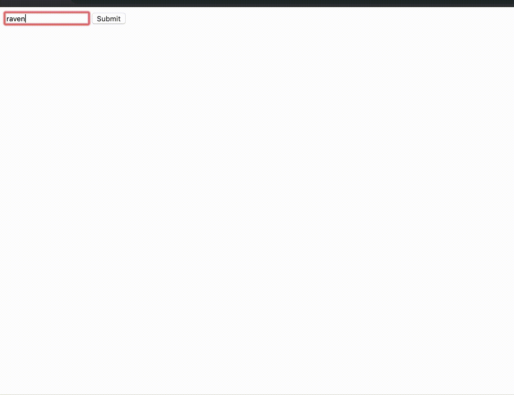

# Challenge:
Build an application (e.g. a cloud function with a single endpoint) that takes text as an input and returns an image found on unsplash or another image platform.

Solution to Day 7 of the #25DaysOfServerless. This solution uses GCP Cloud Run.
Build the image in the cloud shell using the files from this repo
```
docker build . -t day-seven
```
Tag it
```
docker tag day-seven gcr.io/loadbalancescanning/day-seven
```
Push it to GCR
```
docker push gcr.io/loadbalancescanning/day-seven
```
Create cloud run service
After setting up an account and application with Unsplash, you'll create a new service under Cloud Run. I created a new service using the image just created and gave it (the service) a name, set environment variable (name = KEY, value = access key from unsplash API) with unauthenticated invokes (i'm sorry you had to see this my security fam)

Preview:
